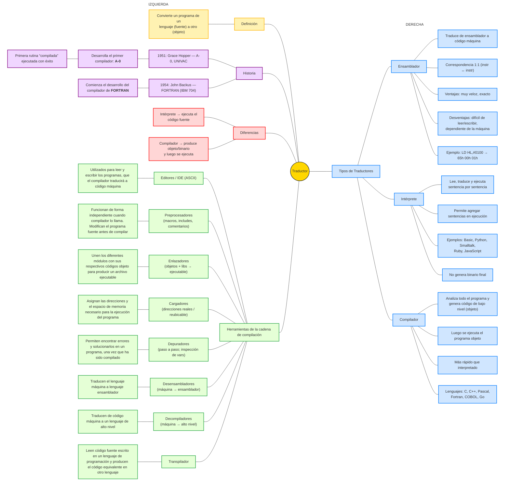

# Parseo_y_Generacion_de_Codigo

# Lenguaje Educativo

## Descripción del lenguaje

Es un lenguaje de programación educativa, con palabras clave que se relacionan a situaciones del entorno académico. Está diseñado para ser simple, legible y didáctico, permitiendo representar conceptos comunes como alumnos, notas, aprobaciones, etc

## Tipos de datos

- **numero** → valor numérico entero.

- **nota** → valor entre 1 y 10 (calificaciones).

- **alumno** → texto (cadenas como "Lucía").

- **bool** → aprobado / desaprobado.

- **lista<tipo_base>** → lista tipada cuyos elementos son **numero**, **nota**, **alumno** o **bool**.

  - No existen literales de lista; se crean vacías con **vacia** y se completan con operaciones.

  - El primer indice de la lista es 1.

## Estructura de programa

Un programa comienza con **INICIO** y termina con **FIN.**. Todas las sentencias válidas van entre esas dos palabras clave.

### Sentencias principales
### Asignación

- Declaración + asignación: ```anotar <tipo> <variable> = <valor>```

- Modificación: ```anotar <variable> = <nuevo_valor>```

- Listas:

  - Crear: ```anotar lista<tipo_base> <lista> = vacia```

  - Acceso: ```<lista>[<indice>]```

  - Asignación por índice: ```anotar <lista>[<indice>] = <valor>```

### Impresión

**mostrar** acepta una expresión de texto que puede concatenar varias partes con + (variables, números, booleanos, accesos a lista, llamadas a función).
Ej.: ```mostrar "Alumno: " + nombre + " | Nota: " + nota```

### Condicional

```evaluar <condicion>``` ejecuta un bloque ```si pasa:``` y, opcionalmente, un bloque ```si no pasa:```.

Negación: ```no <condicion>```

Rango: ```<identificador>``` entre ```<a>``` y ```<b>``` (equivale a ```a <= x y x <= b```)

### Iteración (únicamente mientras)

```mientras <condicion> hacer``` repite mientras la condición sea verdadera.

## Operaciones de lista
- ```agregar <valor> a <lista>``` (Se agrega al final de lista)

- ```quitar en <lista>[<indice>]``` (Elimina por índice)

- ```limpiar <lista>``` (Deja la lista vacía)

## Funciones y procedimientos

- **Funciones:** devuelven un valor con **retornar**. Se aceptan parametros
```
funcion <tipo> <nombre>(parámetros)
    sentencias
    retornar <valor>
finFuncion
```

- **Procedimientos:** no devuelven valor; se invocan como sentencia. Se aceptan parametros
```
procedimiento <nombre>(parámetros)
    sentencias
finProcedimiento
```
## Comentarios

- De línea: ```// comentario```

- De bloque: ```/* comentario */```

## Operadores

- **Aritméticos:** +, -, *, / con precedencia: * / > + - (asociatividad izquierda).
Se admiten paréntesis para agrupar: ( … ).

- **Relacionales:** ==, !=, <, >, <=, >= (se permiten en ambos lados valores/expresiones).

- **Lógicos:** y, o, y prefijo no.

## Reglas semánticas

- nota debe estar en [1..10].

- Tipos de listas estrictos (solo tipo_base permitido).
- 
- Variables de función/procedimiento son locales.

- Todo valor se convierte a texto al imprimir/concatenar en mostrar.

## Ejemplo
```
INICIO

// Listas: alumnos y sus notas. Se inicializan vacias
anotar lista<alumno> alumnos = vacia
anotar lista<nota>   notas   = vacia

// Carga de listas con 'agregar'
agregar "Lucía"  a alumnos
agregar 8        a notas

agregar "Martín" a alumnos
agregar 5        a notas

agregar "Sofía"  a alumnos
agregar 10       a notas

//["Lucía", "Martín", "Sofía"]
//[8, 5, 10]

// Cantidad de registros 
anotar numero cantidad = 3

// Corrección por índice (0-based): Martín pasa a 6
anotar notas[1] = 6
//["Lucía", "Martín", "Sofía"]
//[8, 6, 10]

// Procedimiento: imprime un boletín simple
procedimiento mostrarBoletin(alumno nombre, nota n, bool estado)
    mostrar "Alumno: " + nombre + " | Nota: " + n + " | Estado: " + estado
finProcedimiento

// Función: estado según nota (bool)
funcion bool estadoSegunNota(nota n)
    evaluar n >= 6
        si pasa:
            retornar aprobado
        si no pasa:
            retornar desaprobado
finFuncion

// Función: promedio de n elementos de una lista de notas
funcion nota promedio(lista<nota> xs, numero n)
    anotar numero i = 0
    anotar nota   s = 0
    mientras i < n hacer
        anotar s = s + xs[i]
        anotar i = i + 1
    retornar s / n
finFuncion

// Recorrido con 'mientras' para imprimir boletines
mostrar "Boletines:"
anotar numero i = 0
mientras i < cantidad hacer
    anotar alumno nombre = alumnos[i]
    anotar nota n = notas[i]
    anotar bool est = estadoSegunNota(n)
    mostrarBoletin(nombre, n, est)
    anotar i = i + 1

// Promedio del curso
anotar nota prom = promedio(notas, cantidad)
mostrar "Promedio del curso: " + prom

// Operaciones de lista: quitar y limpiar
mostrar "Quitando última entrada..."
quitar en alumnos[2]
quitar en notas[2]
anotar cantidad = 2

mostrar "Limpiando listas..."
limpiar alumnos
limpiar notas
FIN.
```
## Salida
```
Boletines:
Alumno: Lucía | Nota: 8 | Estado: aprobado
Alumno: Martín | Nota: 6 | Estado: aprobado
Alumno: Sofía | Nota: 10 | Estado: aprobado
Promedio del curso: 8
Quitando última entrada...
Limpiando listas...
```


## BNF
```
<programa> ::= INICIO <sentencias> FIN.

<sentencias> ::= <sentencia> <sentencias> | λ

<sentencia> ::= <asignacion> | <impresion> | <condicional> | <iteracion>
              | <definicion_funcion>
              | <definicion_procedimiento>
              | <llamada_procedimiento>
              | <operacion_lista>

<asignacion> ::= anotar <tipo> <identificador> = <valor>
               | anotar <identificador> = <valor>
               | anotar lista<tipo_base> <identificador> = vacia
               | anotar <identificador> [ <valor> ] = <valor>

<tipo> ::= numero | nota | alumno | bool | lista<tipo_base>

<tipo_base> ::= numero | nota | alumno | bool

<impresion> ::= mostrar <expresion_texto>

<expresion_texto> ::= <valor_texto> | <valor_texto> + <expresion_texto>

<valor_texto> ::= <texto> | <identificador> | <booleano> | <numero>
                | <acceso_lista> | <llamada_funcion>

<condicional> ::= evaluar <condicion> <bloque_condicional>

<bloque_condicional> ::= si pasa: <sentencias>
                       | si pasa: <sentencias> si no pasa: <sentencias>

<condicion> ::= no <condicion>
              | <identificador> entre <valor> y <valor>
              | <valor> <operador_relacional> <valor>
              | <condicion> <operador_logico> <condicion>
              | <booleano> | <identificador>

<iteracion> ::= mientras <condicion> hacer <sentencias>

<valor>   ::= <valor> <op_suma> <termino> | <termino>
<termino> ::= <termino> <op_mul> <factor> | <factor>
<factor>  ::= <numero> | <texto> | <identificador> | <booleano>
            | <acceso_lista> | <llamada_funcion> | "(" <valor> ")"

<op_suma> ::= + | -
<op_mul>  ::= * | /

<acceso_lista> ::= <identificador> [ <valor> ]

<operacion_lista> ::= agregar <valor> a <identificador>
                    | quitar en <identificador> [ <valor> ]
                    | limpiar <identificador>

<definicion_funcion> ::= funcion <tipo> <identificador> ( <parametros_opt> )
                         <sentencias>
                         retornar <valor>
                         finFuncion

<definicion_procedimiento> ::= procedimiento <identificador> ( <parametros_opt> )
                               <sentencias>
                               finProcedimiento

<llamada_funcion> ::= <identificador> ( <argumentos_opt> )
<llamada_procedimiento> ::= <identificador> ( <argumentos_opt> )

<parametros_opt> ::= λ | <lista_parametros>
<lista_parametros> ::= <parametro> | <parametro> , <lista_parametros>
<parametro> ::= <tipo> <identificador>

<argumentos_opt> ::= λ | <lista_argumentos>
<lista_argumentos> ::= <valor> | <valor> , <lista_argumentos>

<booleano> ::= aprobado | desaprobado

<operador_relacional> ::= == | != | < | > | <= | >=
<operador_logico> ::= y | o

<numero> ::= <digito> { <digito> }
<texto> ::= '"' { <letra> | <digito> } '"'
<identificador> ::= <letra> { <letra> | <digito> | _ }

<letra> ::= a | b | ... | z | A | B | ... | Z
<digito> ::= 0 | 1 | ... | 9

<comentario_linea>  ::= "//" {cualquier_caracter_excepto_salto}
<comentario_bloque> ::= "/*" {cualquier_caracter} "*/"
```
# Clase 1
## Introduccion

